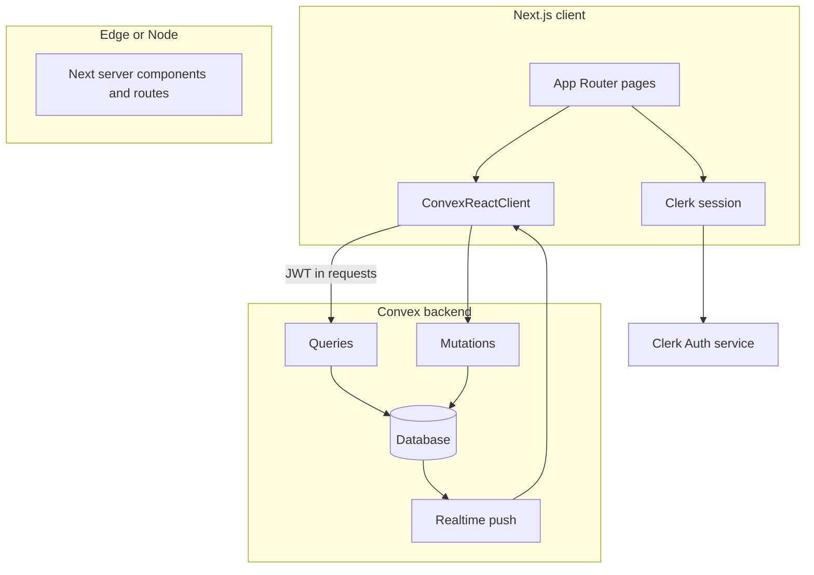

# Architecture diagram

High-level request and data flow for the notes app. See [ARCHITECTURE.md](./ARCHITECTURE.md) for narrative detail.

```mermaid
flowchart TB
  subgraph client [Next.js client]
    UI[App Router pages]
    ConvexReact[ConvexReactClient]
    ClerkUI[Clerk session]
  end

  subgraph edge [Edge or Node]
    NextServer[Next server components and routes]
  end

  subgraph convex [Convex backend]
    Q[Queries]
    M[Mutations]
    DB[(Database)]
    Push[Realtime push]
  end

  ClerkAuth[Clerk Auth service]

  UI --> ConvexReact
  UI --> ClerkUI
  ClerkUI --> ClerkAuth
  ConvexReact -->|"JWT in requests"| Q
  ConvexReact --> M
  Q --> DB
  M --> DB
  DB --> Push
  Push --> ConvexReact
```
